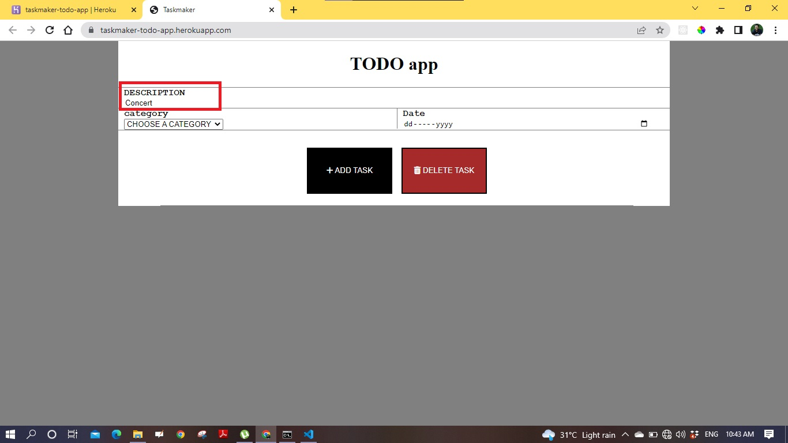
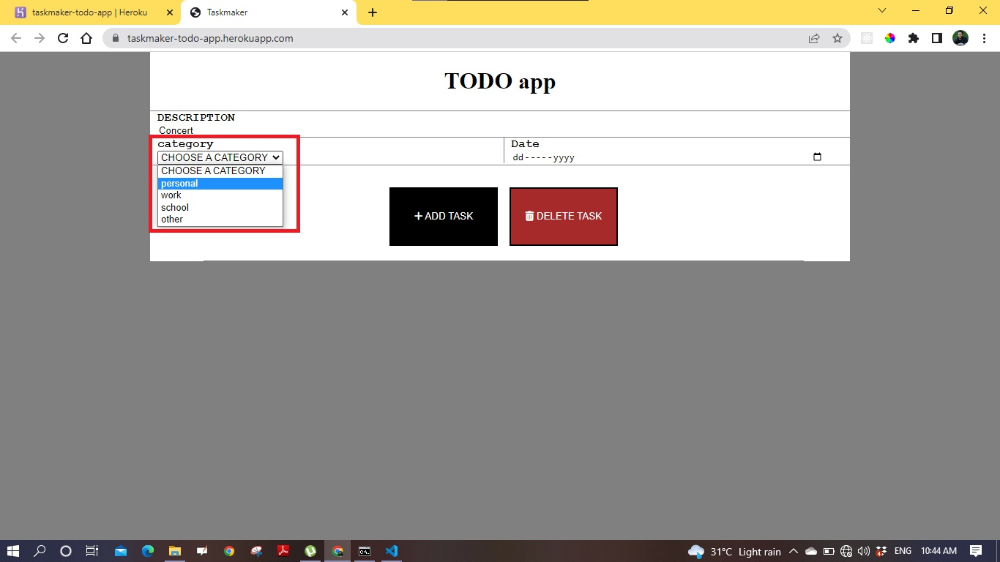
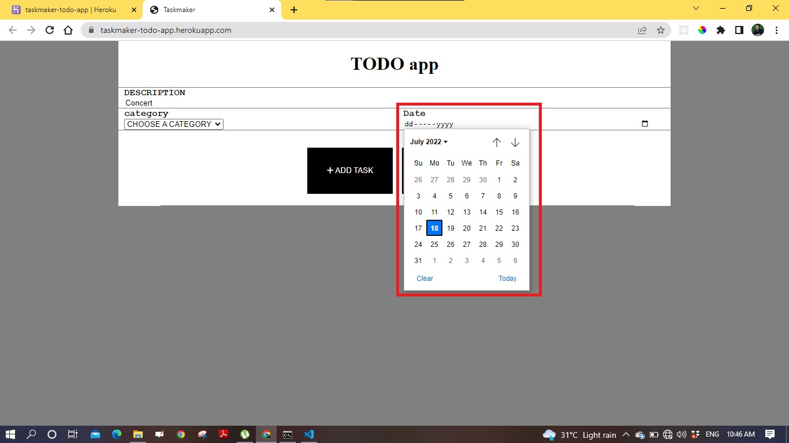
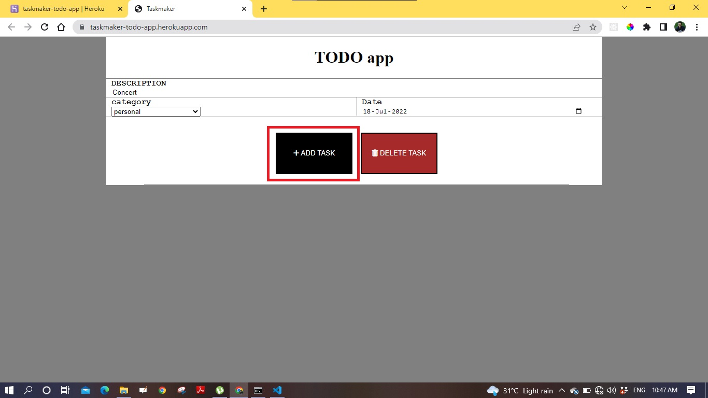
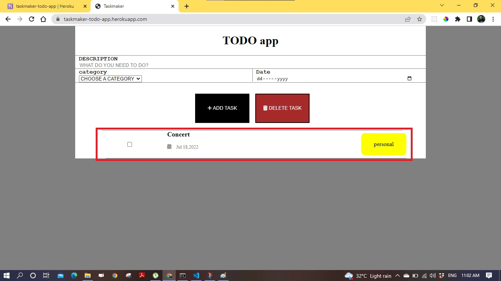
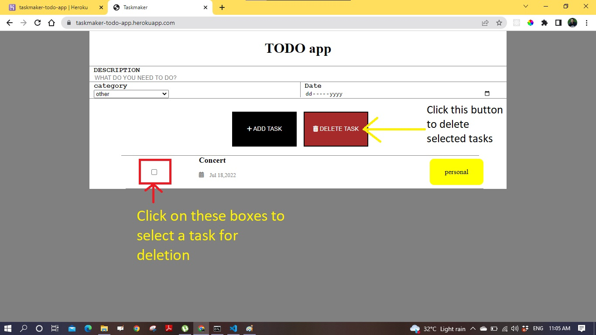

# Taskmaker
User can create task and delete task.

## dependencies:
mongoose, dotenv, ejs, express, nodemon, body-parser 

## Tech Stack:
- Node JS
- Express JS
- Mongo DB
- HTML, CSS
- Heroku

## Features
- Add todo task.
    - Add description of task
    - Choose category of task personal, work, school and other.
    - pick a date for the task
    - add the task by clicking "ADD TASK" button.
- Delete todo task
    - select one task or multiple task
    - click the "DELETE TASK" button to delete the task

# Directory Structure

```
├── README.md
├── assets
│   ├── css
│   │   └── home.css
│   └── js
│       ├── home.js
│       └── jquery.js
├── config
│   └── mongoose.js
├── controllers
│   ├── home_controller.js
│   └── task_controller.js
├── index.js
├── models
│   └── task_schema.js
├── package-lock.json
├── package.json
├── routes
│   ├── index.js
│   └── task.js
└── views
    ├── home.ejs
    └── home2.ejs

```
## Features with details
<ol>
 <li><h3>ADD TASK</h3>
 <ul>
    <li><h4>add description </h4>
    
    </li>
    <li><h4>choose category </h4>
    
    </li>
    <li><h4>select date</h4>
    
    </li>
    <li><h4>add task</h4>
    
    </li>
    <li><h4>newly added task will be shown at the bottom of ADD Task and DELETE TASK button </h4>
    
    </li>
 </ul>
 </li>
  <li><h3>Delete or remove a task</h3>
 <ul>
    <li><h4>Delete singlr task or multiple task by selecting the checkbox before the tasks and clicking the delete button</h4>
    
    </li>

 </ul>
 </li>

</ol>

  
## Git Clone
To use this repository in your local system-

<a href="https://github.com/CoderOnTheRoad/TODO-list" target="_blank">https://github.com/CoderOnTheRoad/TODO-list </a>

or run this command in your GitHub CLI

###### `gh repo clone CoderOnTheRoad/TODO-list`
<br>


## <a href = "https://taskmaker-todo-app.herokuapp.com/" target="_blank"> Demo / Hosted on - https://taskmaker-todo-app.herokuapp.com/ </a>